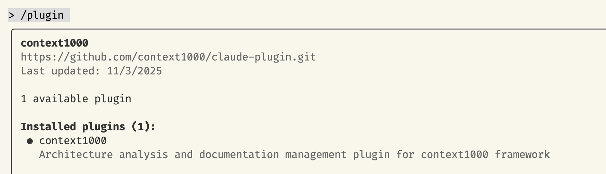
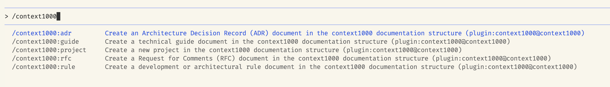
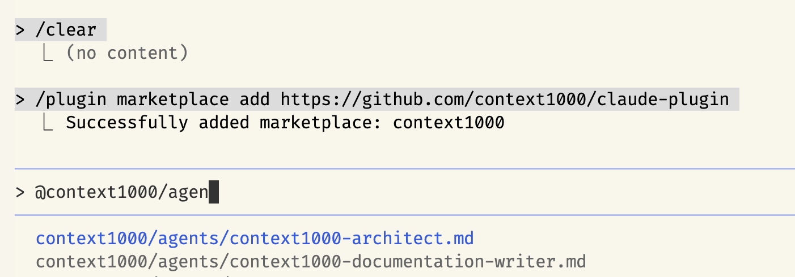

# context1000/claude-plugin

Claude plugin with 2 sub-agents, 5 commands for creating architecture documentation with context1000



## Installation

Run claude CLI and install the plugin:

```bash
/plugin marketplace add https://github.com/context1000/claude-plugin
```

## What is context1000?

context1000 is a strict documentation format designed for AI agents that organizes architectural knowledge into four artifact types: **decisions** (RFCs and ADRs), **rules**, **guides**, and **projects**. It captures both the reasoning behind decisions and the actionable requirements that follow, enabling AI systems to understand not just what to do, but why.

Learn more: [context1000](https://github.com/context1000/docs)

## Claude **slash commands**



Create documentation artifacts using structured commands:

```bash
# Architecture Decision Records
/context1000:adr "Choose database technology" --status draft
/context1000:adr "API versioning strategy" --project mobile-app

# Request for Comments
/context1000:rfc "Microservices migration plan" --status review
/context1000:rfc "Event-driven architecture" --project backend

# Development Rules
/context1000:rule "API naming conventions" --severity required
/context1000:rule "Code review standards" --project frontend

# Technical Guides
/context1000:guide "Setting up local development"
/context1000:guide "Deployment process" --project api-service

# Projects (create scoped documentation containers)
/context1000:project "mobile-app"
```

## Claude **Subagents**



Two specialized agents work together to maintain your documentation:

### Architect Agent (`@context1000:context1000-architect`)

**Purpose**: Analyzes architecture and creates documentation artifacts

**What it does**:

- Analyzes code structure, dependencies, and architectural patterns
- Proposes documentation artifacts (ADRs, RFCs, guides, rules)
- Creates artifacts via slash commands only (never edits files directly)
- Hands off to Documentation Writer for validation

**Example usage**:

```text
@context1000:context1000-architect analyze the authentication system and create relevant docs
```

### Documentation Writer Agent (`@context1000:context1000-documentation-writer`)

**Purpose**: Validates and maintains documentation consistency

**What it does**:

- Validates artifacts against templates (MADR format)
- Checks cross-references and bidirectional links
- Enforces word count limits and style guidelines
- Fixes broken references and missing sections
- Reports issues back to Architect for resolution

**Example usage**:

```text
@context1000:context1000-documentation-writer validate all ADRs in .context1000/
```

## How Agents Work with Slash Commands

The agents follow a strict workflow:

1. **Architect Agent** analyzes code and proposes documentation
2. **Architect** creates artifacts using **slash commands only** (via `SlashCommand` tool)
3. Slash commands create files with proper structure, frontmatter, and templates
4. **Architect** hands off to **Documentation Writer** with structured report
5. **Documentation Writer** validates artifacts, fixes issues, and reports back
6. If critical issues found, **Architect** addresses them via slash commands
7. Loop continues until documentation is consistent or user input needed

**Key principle**: Agents never create or edit files directly. All artifact creation flows through slash commands, ensuring consistency and proper structure.

## Skills

The plugin includes 11 specialized skills that work proactively:

- `detect-adr-opportunities` - Identifies when architectural decisions should be documented
- `rfc-to-adr-linker` - Connects accepted RFCs to formal ADRs
- `architecture-diff-analyzer` - Analyzes large changes and recommends artifact types
- `doc-style-enforcer` - Ensures artifacts follow templates and conventions
- `diataxis-classifier` - Classifies docs by Diátaxis framework
- And 6 more for glossaries, examples, cross-linking, and style editing

Skills activate automatically based on context (e.g., detecting technology changes triggers ADR opportunity detection).

---

- **Repository**: [context1000 Claude Plugin](https://github.com/context1000/claude-plugin)
- **Documentation**: [context1000 Docs](https://github.com/context1000/docs)
